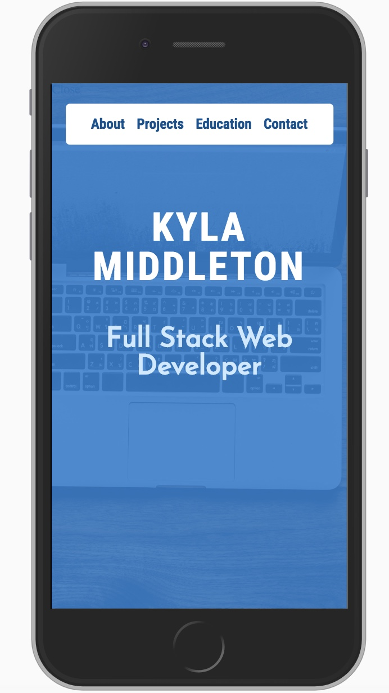
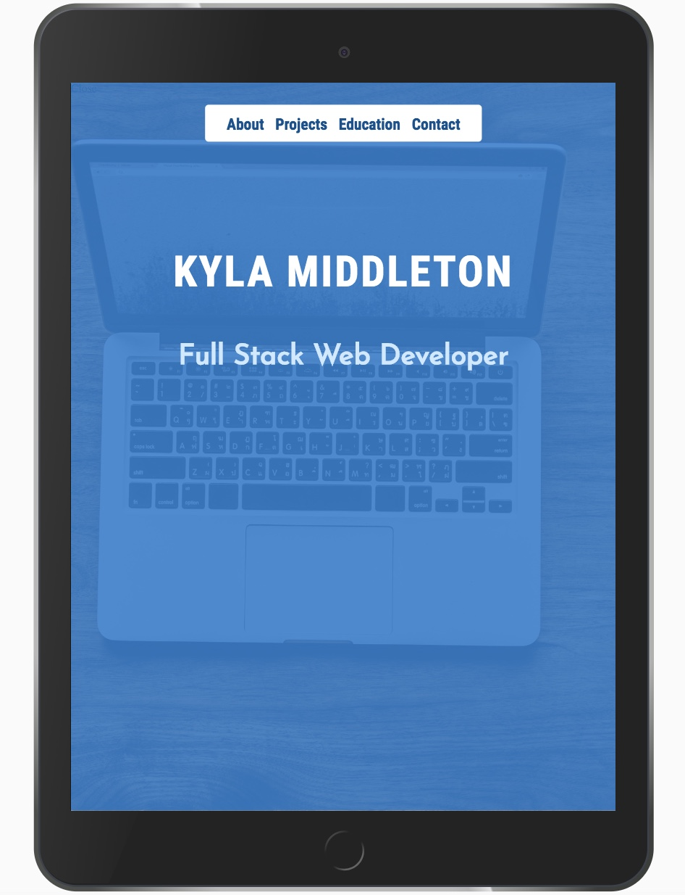
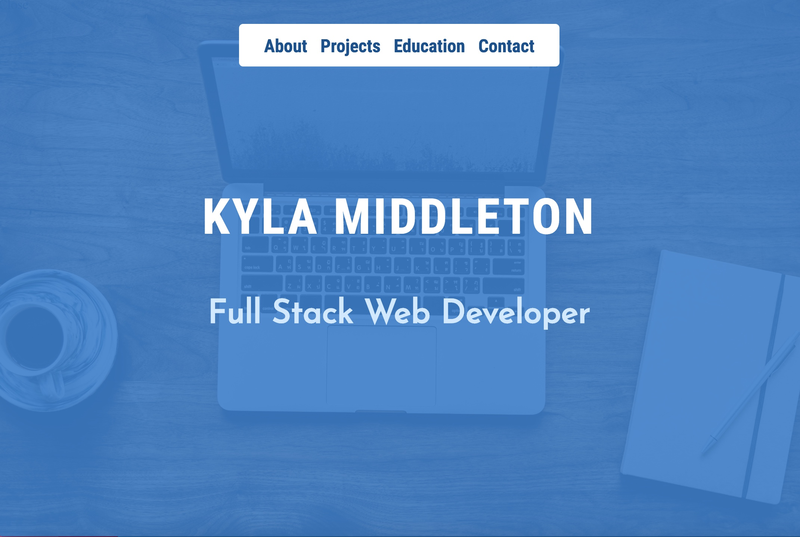

# Portfolio for Kyla Middleton

A web development portfolio to showcase projects and knowledge aquired in the Full Stack Web Development bootcamp at the Georgia Institute of Technology. 

This is a multipage application built with a mobile first css styling and is fully responsive. 

## Portfolio Images: 

# Code Structure
- assets:  Profile Picture
- images: Project Images
- styles:
    * about
    * contact
    * education
    * index
    * projects
    * reset
- html:
    * about
    * contact
    * education
    * index
- app.js
- other:
    * node_modules
    * .gitignore
    * package-lock.json
    * package.json
    * README

# Author
- Kyla Middleton

# Acknowledgements
Photo by rawpixel: https://unsplash.com/photos/1r30K4tqMwM